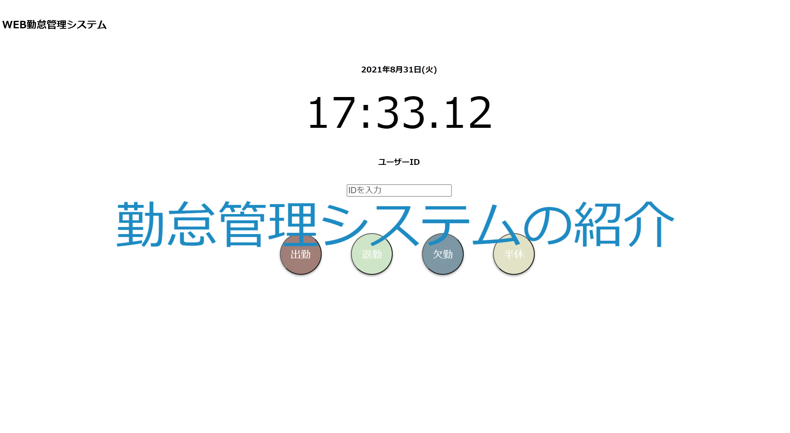
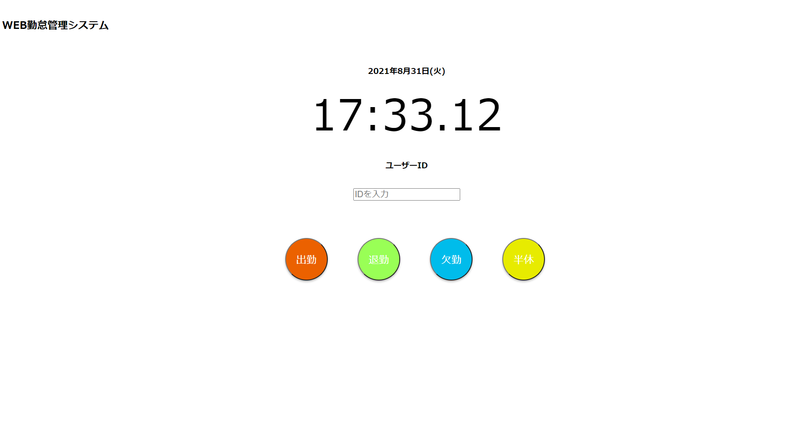
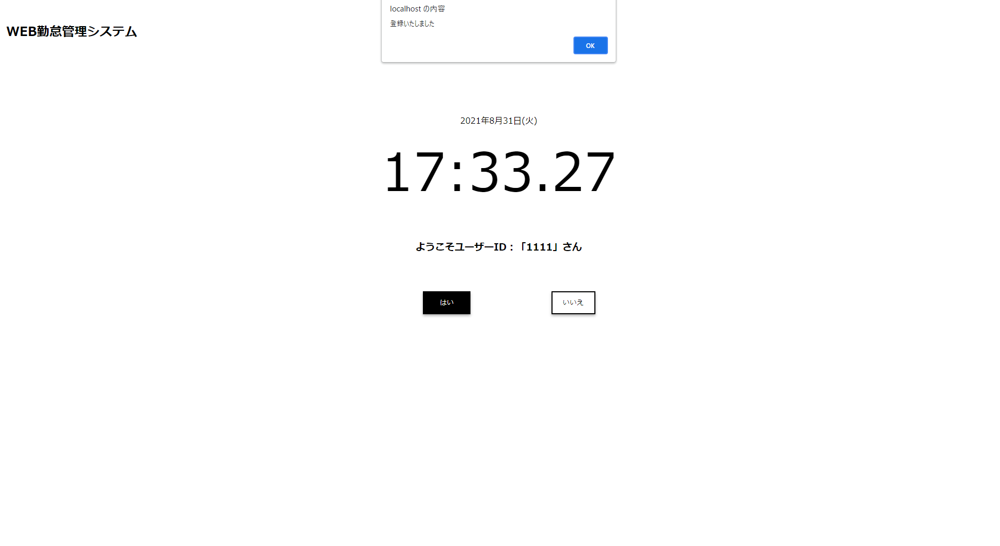
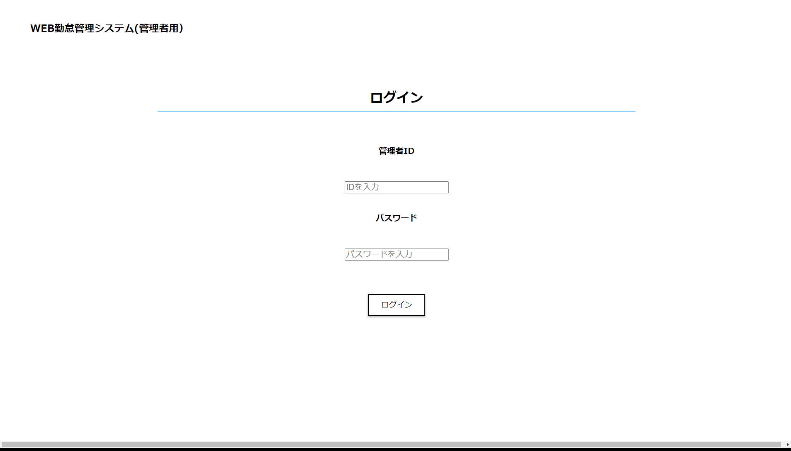
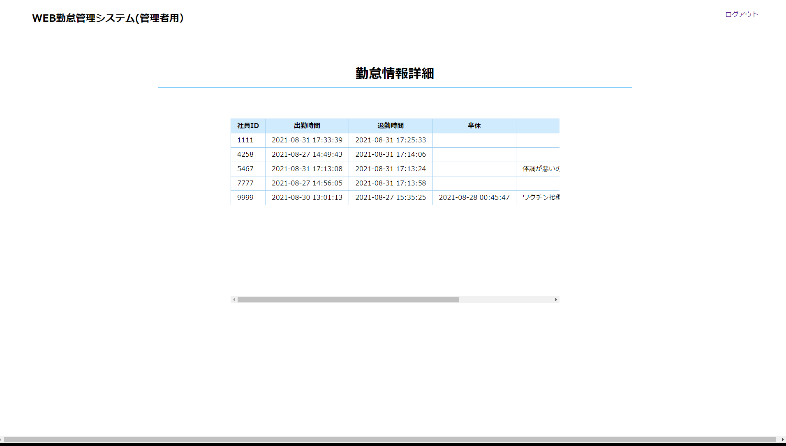
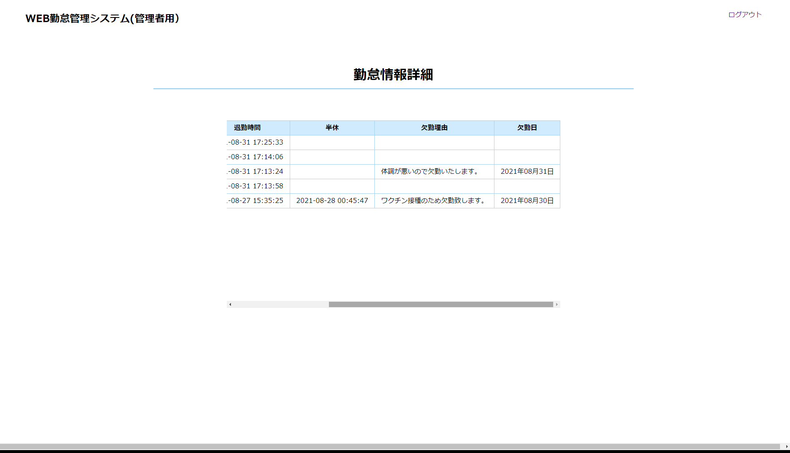

# Time and attendance system  
  
この勤怠管理システムは、初めての作品として制作したシステムです。デザインはシンプルで分かりやすいように設計しております。ボタンで時間を送信出来る打刻となっております。あらかじめSQLで登録したユーザーIDをテキストに入力して打刻を登録するように設定しております。 
 
この作品は管理者がユーザーの打刻情報を見れるシステムも制作しております。ユーザーの打刻情報の一覧を見るにはまず、ログインをして入らなければならない保護を制作しております。ログイン機能もあらかじめSQLに登録してあるIDとパスワードでログイン出来るようにしてあります。打刻情報は登録された都度送信されたデータを更新するような作りとなっております。
 
※このシステムは作品として紹介していますのでデモを試すには、まずphpがネットワークに接続出来るようにしてください。また、SQLファイルをインポートしてSQLも接続できるようにしてください。

# table of contents
- Sistem image(User side)
- Sistem image(Sier side)
- File Structure
- Programming language
# Sistem image(User side)
kanri1.php


kanri2.php


# Sistem image(Sier side)
login.php


main.php(1)


main.php(2)



# File Structure
ダウンロードしたファイルには、次のディレクトリとファイルがあります。 

```
Time and attendance system /  
├── kintai/  
|   ├── css/  
|   |   ├── kanri1.css  
|   |   ├── kanri2.css  
|   |   ├── kanri3.css  
|   |   ├── kanri4.css  
|   |   ├── kanri5.css  
|   |   ├── login.css  
|   |   └── main.css  
|   ├── js/  
|   |   ├── hizuke1.js  
|   |   └── zikoku.js  
|   ├── php/  
|        ├── kanri1.php  
|        ├── kanri2.php  
|        ├── kanri3.php  
|        ├── kanri4.php  
|        ├── kanri5.php  
|        ├── login.php  
|        └── main.php  
|   
|
└── sql/  
      └── kintaikanri.sql  
``` 
 


# Programming language
